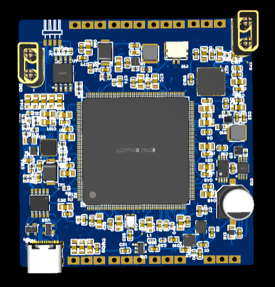
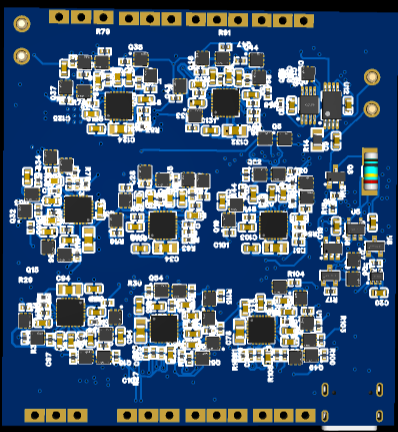
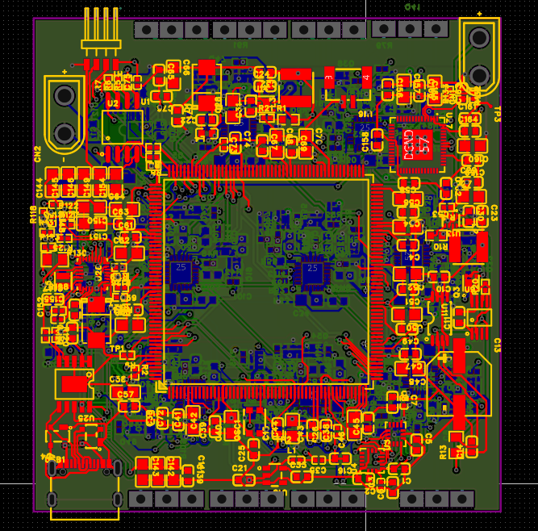
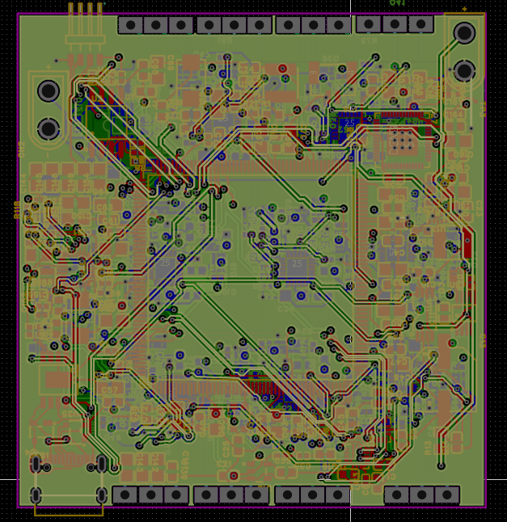
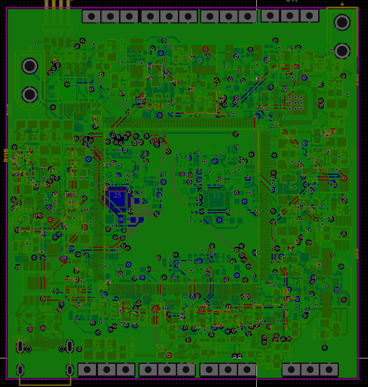
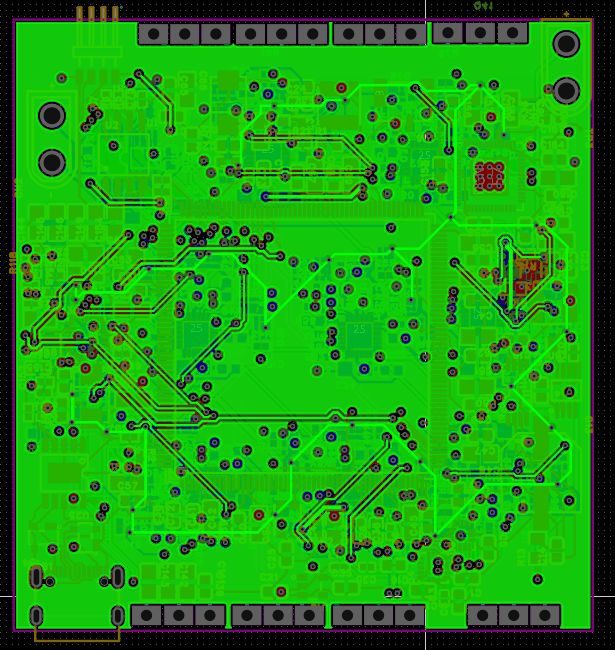
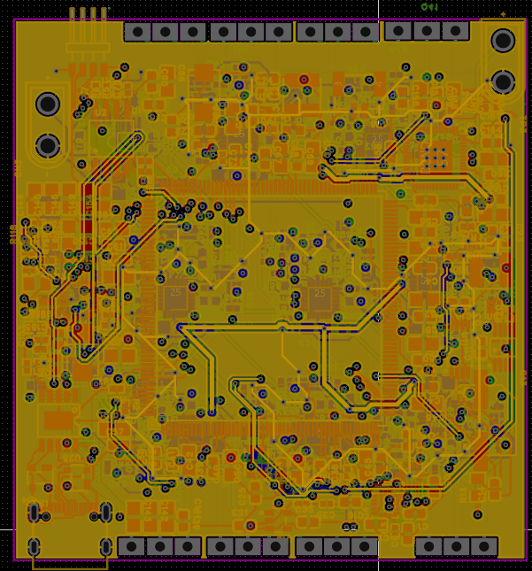
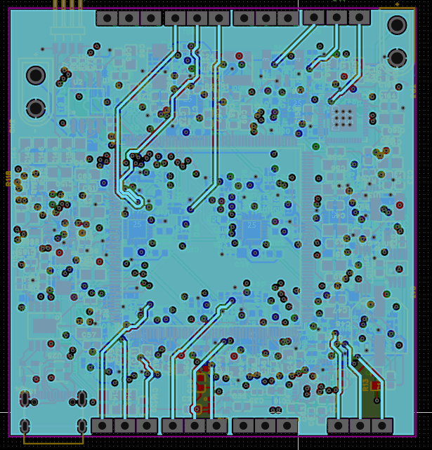
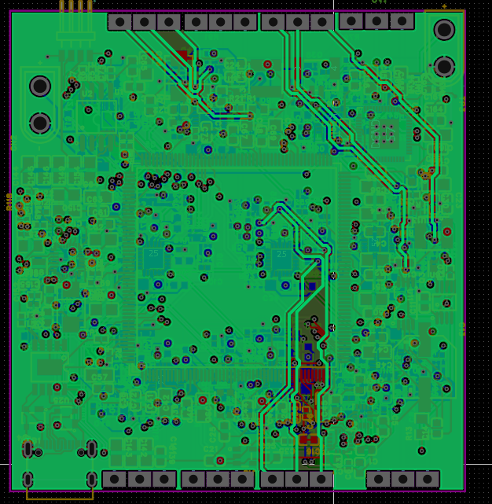
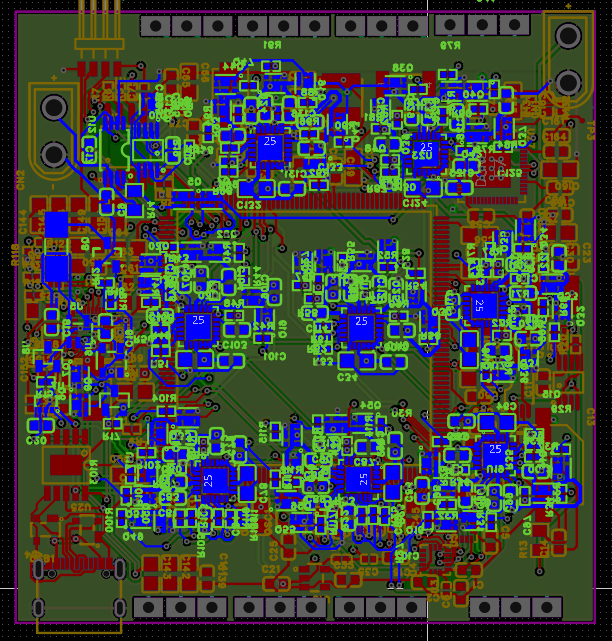

# **Cortex-8**

**8-in-1 AIO Flight Controller for X8 Coaxial Racing Drones**

**High-performance X8 coaxial FPV racing drone flight controller** — everything integrated on a single 61×65mm board.

---

## **Overview**

Cortex-8 is a **custom 8-in-1 all-in-one flight controller** designed from scratch for high-performance X8 coaxial FPV racing drones.

Every subsystem — flight control, ESC power stage, dual battery matrix, USB-PD charging, digital FPV video, and **emergency crash locator** — lives on a **single 61×65mm 8-layer HDI PCB**.

> **"You will never lose this drone."**

---

## **Key Features**

### **Flight Control**
- **STM32H743BIT6** @ 480MHz with hardware crypto
- Full **8-motor X8 coaxial** support with **DShot600** bidirectional (conflict-free)
- **Dual IMU** — ICM-42688-P (32kHz) + ICM-20602 backup
- **128MB QSPI Blackbox** with wear leveling
- Temperature-compensated **16MHz TCXO**
- **ESP32-S3** for ELRS + Wi-Fi/BLE

### **Dual Battery Matrix**
- Switch between **7.4V (parallel)** and **14.8V (series)** in flight
- Hardware interlock prevents short circuits
- Ideal diode protection + pre-charge soft-start
- Mid-flight balancing

### **Octo-ESC Power Stage**
- 8× dedicated **FD6288Q** gate drivers
- 48× **CSD17313Q2** MOSFETs (**10A continuous** per phase)
- High-side current sensing with PWM rejection

### **Power & Charging**
- Dual high-efficiency bucks
- **140W USB-PD** (20V EPR) fast charging
- Filtered rail for OpenFPV camera

### **Digital FPV**
- **OpenFPV** (SSC338Q + IMX415)
- **RTL8812EU** 5GHz Wi-Fi (**29dBm**)
- **5–6km** range with PixelPilot

### **Safety & Recovery**
- Hardware arming inhibit (works even if MCU is crashed)
- Dual watchdog timers
- **Emergency Crash Locator** — 300mAh backup + BLE SOS beacon (**48+ hours**)

---

## **PCB Design**

**61×65mm • 8-layer HDI • Via-in-Pad • JLCPCB Advanced**

**Layer Stackup:**

| Layer | Purpose                        | Copper |
|-------|--------------------------------|--------|
| L1    | Signals + Components           | 2oz    |
| L2    | DShot signals                  | 1oz    |
| L3    | Clean DGND                     | 1oz    |
| L4    | VBAT_PRIMARY (Power)           | 2oz    |
| L5    | Dirty ESC GND                  | 2oz    |
| L6    | Shielding                      | 2oz    |
| L7    | Analog GND                     | 1oz    |
| L8    | MOSFETs + Drivers              | 2oz    |

---

## **Key Specs**

| Parameter           | Value                                      |
|---------------------|--------------------------------------------|
| **MCU**             | STM32H743BIT6 @ 480MHz                     |
| **Wireless**        | ESP32-S3 (ELRS + Wi-Fi + BLE)              |
| **Motors**          | 8× X8 Coaxial                              |
| **Battery**         | 2× 2S LiPo (7.4V / 14.8V switchable)      |
| **Max Current**     | 10A continuous per phase                   |
| **Charging**        | 140W USB-PD EPR                            |
| **Blackbox**        | 128MB QSPI                                 |
| **FPV**             | OpenFPV (IMX415) — up to **5-6km**         |
| **Size**            | 61×65mm                                    |
| **Mounting**        | 30.5×30.5mm M2                             |

---

## **Getting Started**

1. Clone the repo
2. Check [Schematics](/hardware/) and [Firmware](/firmware/)
3. Order PCBs from JLCPCB (files in `gerbers/`)

**Need help?** Open an issue or join the discussion!

---

**Built for performance. Engineered for reliability.**

IMAGES----

TOP PCB 3D

BOTTOM PCB 3D

TOP LAYER TRACE

INNER LAYER 1

INNER LAYER 2

INNER LAYER 3

INNER LAYER 4

INNER LAYER 5

INNER LAYER 6

BOTTOM LAYER TRACE

Designed by Muduganti Aman Reddy | Hackclub
