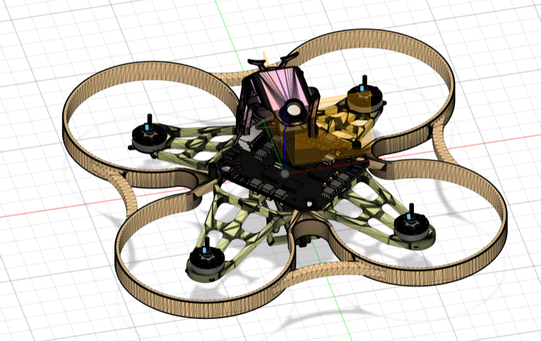
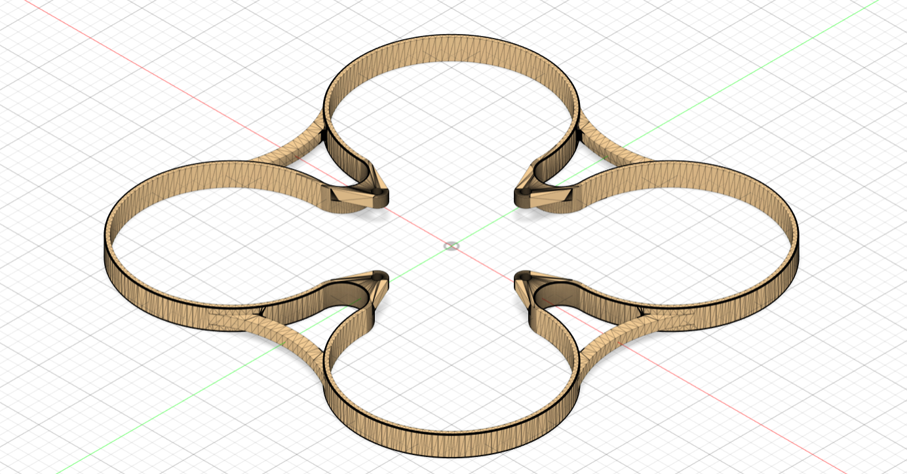
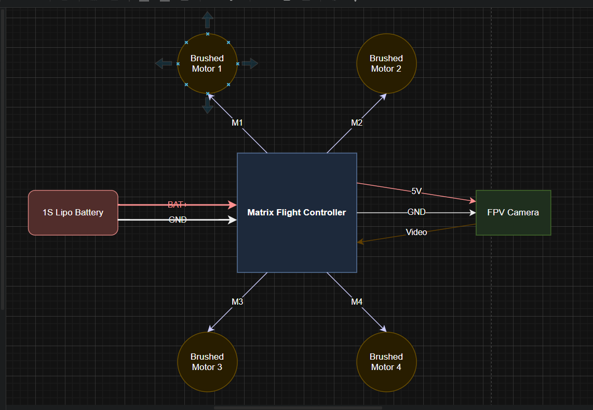

@ My AI Racing Buddy (or ash)

Building an AI-controlled FPV racing drone to be my racing partner since I have no one to race with.

@ The Setup
* **Drone 1 (Me):** Controlled with my Avionic transmitter
* **Drone 2 (AI):** Controlled by Raspberry Pi with computer vision
* **Ground Station:** Pi processes FPV feeds, sends commands

@ Why?
I love FPV racing but it's boring alone. Building my own opponent!
## CAD Design

### Complete Assembly

### Frame Design

### Canopy with Camera Mount

### Ducted Prop Guards

### Wiring Diagram

### BOM
| Product name                      | Product description            | Product link                                                                         | Unit Price (INR) | Amount | Total (INR) |
|-----------------------------------|--------------------------------|--------------------------------------------------------------------------------------|------------------|--------|-------------|
| Radiomaster Pocket                | ELRS Controller (Transparent)  | https://robu.in/product/radiomaster-pocket-radio-controller-elrs-transparent/        | 6389             | 1      | 6389        |
| Matrix 1S FC                      | AIO Flight Controller (5-in-1) | https://betafpv.com/products/matrix-1s-brushless-flight-controller                   | 4588.72          | 1      | 10977.72    |
| LAVA 1S 450mAh Battery            | High-discharge LiPo (4-Pack)   | https://betafpv.com/products/lava-1s-450mAh-75c-battery-4pcs                         | 1009.26          | 2      | 12996.24    |
| 0802SE Brushless Motors           | 19500KV (2022 Version)         | https://betafpv.com/products/0802se-brushless-motors-2022-version                    | 3579             | 1      | 16575.24    |
| 5.8G OTG Receiver                 | UVC Receiver for Android Phone | https://loftyagrotech.com/5-8g-fpv-otg-receiver-for-android/                         | 4100             | 1      | 20675.24    |
| BetaFPV 6-Port Charger            | 1S LiPo/LiHV Charger & Adapter | https://betafpv.com/products/bt2-0-ph2-0-1s-lipo-charger-adapter                     | 1101             | 1      | 21776.24    |
| APFEN 30W Power Brick             | USB-C PD Wall Adapter          | https://www.amazon.in/Original-Rapidly-Charging-Compatible-Devices/dp/B0FBKDLD4T     | 639              | 1      | 22415.24    |
| Camera C03                        | FPV Micro Camera               | https://betafpv.com/products/c03-fpv-micro-camera                                    | 1098             | 1      | 23513.24    |
| BT2.0 Whoop Pigtail               | Battery Connector (Pack of 6)  | https://robu.in/product/betafpv-bt2-0-whoop-cable-pigtail-6pcs/                      | 549.84           | 1      | 24063.08    |
| Air75 II Frame                    | 75mm Whoop Frame (Black)       | https://betafpv.com/products/air75-ii-brushless-whoop-frame                          | 457              | 2      | 24977.08    |
| Heat Shrink 1mm Red               | WOER HST (1M)                  | https://robu.in/product/heat-shrink-sleeve-1mm-red-industrial-grade-woer-hst/        | 10               | 1      | 24987.08    |
| Heat Shrink 2mm Red               | WOER HST (1M)                  | https://robu.in/product/heat-shrink-sleeve-2mm-red-industrial-grade-woer-hst/        | 12               | 1      | 24999.08    |
| Heat Shrink 3mm Red               | WOER HST (1M)                  | https://robu.in/product/heat-shrink-sleeve-3mm-red-industrial-grade-woer-hst/        | 7                | 1      | 25006.08    |
| Heat Shrink 4mm Red               | WOER HST (1M)                  | https://robu.in/product/heat-shrink-sleeve-4mm-red-industrial-grade-woer-hst/        | 18               | 1      | 25024.08    |
| Heat Shrink 5mm Red               | WOER HST (1M)                  | https://robu.in/product/heat-shrink-sleeve-5mm-red-industrial-grade-woer-hst/        | 23               | 1      | 25047.08    |
| Heat Shrink 8mm Red               | WOER HST (1M)                  | https://robu.in/product/heat-shrink-sleeve-8mm-red-industrial-grade-woer-hst/        | 29               | 1      | 25076.08    |
| 22AWG Flex Wire Black             | Power Wiring (Negative)        | https://robu.in/product/high-quality-ultra-flexible-22awg-silicone-wire-1000m-black/ | 18               | 3      | 25130.08    |
| 22AWG Flex Wire Red               | Power Wiring (Positive)        | https://robu.in/product/high-quality-ultra-flexible-22awg-silicone-wire-1500m-red/   | 18               | 3      | 25184.08    |
| 30AWG Flex Wire Red               | Signal/Camera Wiring           | https://robu.in/product/30awg-high-quality-ultra-flexible-silicone-wire-red/         | 5                | 4      | 25204.08    |
| Eachine EV800 FPV Goggles – Black | fpv goggles                    | https://robu.in/product/eachine-ev800-fpv-goggles-black/                             | 7,960.00         | 1      | 33,164.08   |

### CAD 
[CAD Files](./CAD)

## Tech Stack
* 75mm brushless whoops
* Raspberry Pi 4 + GPS + camera
* OpenCV for drone tracking
* Custom 3D printed frames in Fusion 360

## Progress
- [x] Design custom 75mm drone frame 
- [x] Design camera canopy 
- [x] Design ducted prop guards 
- [x] Complete CAD assembly with electronics
- [x] Export .STEP file for manufacturing
- [ ] Order parts 
- [ ] Build physical drone
- [ ] Develop virtual AI opponent (OpenCV)
- [ ] Test flight & tune
- [ ] Code real AI control system
- [ ] First race!

Custom-designed every component from scratch:
- Lightweight X-frame (8g)
- Protective ducted guards (4g)  
- Integrated camera canopy
- Optimized for 0802SE motors + Matrix FC

## Firmware

Uses **Betaflight 4.5.0** (pre-installed on Matrix FC).

Default configuration works out of the box. 
Custom tuning done after test flights.

## Wiring
| Component | Connects To |
|-----------|-------------|
| Motors 1-4 | Matrix FC motor pads |
| Camera | Matrix FC cam input |
| Battery | Matrix FC BAT input |
| (Matrix has built-in VTX, RX, ESC) |

## Phase 1: Single Drone Build
Building ONE real drone first with virtual AI opponent.
Ground station (Raspberry Pi) will be added in future 
phase - for now AI runs on laptop with camera feed.
