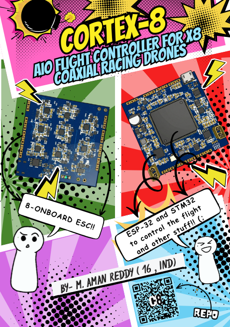

# **Cortex-8**

**8-in-1 AIO Flight Controller for X8 Coaxial Racing Drones**

**High-performance X8 coaxial FPV racing drone flight controller** — everything integrated on a single 61×65mm board.

---
## **Project Vision**

This is the **5th generation** of my custom AIO flight controller.

I’m building this because I want to see **how far I can push the limits** of what a single person (with help from AI) can achieve in drone hardware and autonomy.

My goal is simple yet ambitious:
- Design high-performance flight controllers from scratch
- Fully integrate every subsystem onto one compact board
- Explore **AI-driven autonomous flight** — drones that can think and react on their own without human intervention

I’ve always been fascinated by machines that work independently. This project is my playground to experiment with advanced flight control, power systems, digital FPV, crash recovery, and eventually full AI autonomy.

**Cortex-8** is another step toward that vision.

## **Overview**

Cortex-8 is a **custom 8-in-1 all-in-one flight controller** designed from scratch for high-performance X8 coaxial FPV racing drones.

Every subsystem — flight control, ESC power stage, dual battery matrix, USB-PD charging, digital FPV video, and **emergency crash locator** — lives on a **single 61×65mm 8-layer HDI PCB**.

> **"You will never lose this drone."**

---

## **Key Features**

### **Flight Control**
- **STM32H743BIT6** @ 480MHz with hardware crypto
- Full **8-motor X8 coaxial** support with **DShot600** bidirectional (conflict-free)
- **Dual IMU** — ICM-42688-P (32kHz) + ICM-20602 backup
- **128MB QSPI Blackbox** with wear leveling
- Temperature-compensated **16MHz TCXO**
- **ESP32-S3** for ELRS + Wi-Fi/BLE

### **Dual Battery Matrix**
- Switch between **7.4V (parallel)** and **14.8V (series)** in flight
- Hardware (AND gate + inverter) interlock prevents short circuits
- TLV3201 comparator disables switching above 30A
- Ideal diode protection + pre-charge soft-start
- Mid-flight balancing

### **Octo-ESC Power Stage**
- 8× dedicated **FD6288Q** gate drivers
- 48× **CSD17313Q2** MOSFETs (**10A continuous** per phase)
- 2× **INA240A2** current sensors with Kelvin-connected shunts
- Snubber capacitors on every motor phase
- High-side current sensing with PWM rejection

### **Power & Charging**
- Dual high-efficiency bucks
- **TPS62840** 3.3V/2A buck for STM32 & IMUs
- **TPS62170** 5V/2A buck for ESP32 & peripherals
- **140W USB-PD** (20V EPR) fast charging
- Filtered rail for OpenFPV camera

### **Digital FPV**
- **OpenFPV** system: **SSC338Q + IMX415** camera
- **BL-M8812EU2** (RTL8812EU, **29dBm**) 5GHz Wi-Fi adapter
- **Up to 5–6km** range with PixelPilot ground station

### **Hardware Safety Systems**
- **Hardware arming inhibit** via JST-GH safety switch (kills all 8 gate driver EN pins)
- **WWDG + IWDG** dual watchdog
- **WS2812B** RGB LED status + passive buzzer
- **Emergency Crash Locator** with 300mAh backup LiPo + BLE SOS beacon (48+ hours)

---

## **PCB Design**

**61×65mm • 8-layer HDI • Via-in-Pad • JLCPCB Advanced**

**Layer Stackup:**

| Layer | Purpose                        | Copper |
|-------|--------------------------------|--------|
| L1    | Signals + Components           | 2oz    |
| L2    | DShot signals                  | 1oz    |
| L3    | Clean DGND                     | 1oz    |
| L4    | VBAT_PRIMARY (Power)           | 2oz    |
| L5    | Dirty ESC GND                  | 2oz    |
| L6    | Shielding                      | 2oz    |
| L7    | Analog GND                     | 1oz    |
| L8    | MOSFETs + Drivers              | 2oz    |

---

## **Key Specs**

| Parameter              | Value                                      |
|------------------------|--------------------------------------------|
| **MCU**                | STM32H743BIT6 @ 480MHz                     |
| **Wireless**           | ESP32-S3 (Wi-Fi + BLE + ELRS)              |
| **Motors**             | 8 (X8 Coaxial)                             |
| **Battery**            | 2× 2S LiPo (Series/Parallel switchable)    |
| **Voltage Modes**      | 7.4V (parallel) / 14.8V (series)           |
| **Max Current**        | 10A continuous per phase                   |
| **Charging**           | 140W USB-PD (20V EPR)                      |
| **Blackbox**           | 128MB QSPI Flash                           |
| **FPV**                | OpenFPV (SSC338Q + IMX415)                 |
| **Video Range**        | 5–6km @ 5GHz                               |
| **PCB Size**           | 61×65mm                                    |
| **Layers**             | 8-layer HDI                                |
| **Stack**              | 30.5×30.5mm M2                             |
| **Fabrication**        | JLCPCB Advanced + ENIG + X-ray             |
---

**Need help?** Open an issue or join the discussion!

---

**Built for performance. Engineered for reliability.**

BOM

|No.|Quantity|Comment              |Designator                                                                                                                                                                                                                                                                                                                                                            |Footprint                             |Value |Manufacturer Part     |Manufacturer       |Supplier Part|Supplier|JLCPCB Price|JLCPCB Stock|
|---|--------|---------------------|----------------------------------------------------------------------------------------------------------------------------------------------------------------------------------------------------------------------------------------------------------------------------------------------------------------------------------------------------------------------|--------------------------------------|------|----------------------|-------------------|-------------|--------|------------|------------|
|1  |84      |100nF                |C1,C2,C5,C6,C8,C9,C10,C14,C15,C16,C17,C18,C19,C20,C21,C23,C25,C26,C29,C30,C31,C32,C33,C37,C39,C41,C43,C45,C47,C49,C51,C53,C55,C57,C59,C61,C63,C65,C67,C69,C72,C74,C76,C77,C79,C80,C81,C85,C87,C88,C89,C93,C95,C96,C97,C101,C103,C104,C105,C109,C110,C111,C115,C117,C118,C119,C123,C125,C126,C127,C131,C133,C134,C135,C139,C140,C156,C158,C159,C161,C162,C163,C164,C166|C0603                                 |100nF |CC0603KRX7R9BB104     |YAGEO(国巨)          |C14663       |LCSC    |0.0026      |14950789    |
|2  |7       |1uF                  |C3,C7,C35,C36,C38,C73,C75                                                                                                                                                                                                                                                                                                                                             |C0402                                 |1uF   |0402X105K250NT        |FH(风华)             |C967571      |LCSC    |0.0018      |91670       |
|3  |4       |2.2uF                |C4,C11,C12,C71                                                                                                                                                                                                                                                                                                                                                        |C0603                                 |2.2uF |CL10A225KO8NNNC       |SAMSUNG(三星)        |C23630       |LCSC    |0.0014      |1034471     |
|4  |1       |220uF                |C13                                                                                                                                                                                                                                                                                                                                                                   |CAP-SMD_BD8.0-L8.3-W8.3-LS9.3-FD      |220uF |RVT220UF35V67RV0024   |KNSCHA(科尼盛)        |C2836441     |LCSC    |0.012       |81517       |
|5  |2       |47uF                 |C22,C24                                                                                                                                                                                                                                                                                                                                                               |C0603                                 |47uF  |GRM188R60J476ME15D    |muRata(村田)         |C140782      |LCSC    |0.0212      |194067      |
|6  |39      |10uF                 |C27,C28,C34,C40,C42,C44,C46,C48,C50,C52,C54,C56,C58,C60,C62,C64,C66,C68,C70,C78,C86,C94,C102,C116,C124,C132,C141,C142,C143,C144,C145,C146,C149,C150,C151,C154,C157,C160,C165                                                                                                                                                                                          |C0805                                 |10uF  |GRM21BR71E106KEBHL    |muRata(村田)         |C5299751     |LCSC    |0.0243      |1523        |
|7  |24      |10nF                 |C82,C83,C84,C90,C91,C92,C98,C99,C100,C106,C107,C108,C112,C113,C114,C120,C121,C122,C128,C129,C130,C136,C137,C138                                                                                                                                                                                                                                                       |C0603                                 |10nF  |CC0603KRX7R9BB103     |YAGEO(国巨)          |C100042      |LCSC    |0.0009      |17534       |
|8  |3       |47nF                 |C147,C148,C153                                                                                                                                                                                                                                                                                                                                                        |C0402                                 |47nF  |0402B473K100CT        |Walsin(华新科)        |C301947      |LCSC    |0.0005      |15          |
|9  |1       |4.7uF                |C152                                                                                                                                                                                                                                                                                                                                                                  |C0603                                 |4.7uF |CL10A475KP8NNNC       |SAMSUNG(三星)        |C1705        |LCSC    |0.0019      |96271       |
|10 |1       |2.2uF                |C155                                                                                                                                                                                                                                                                                                                                                                  |C0603                                 |2.2uF |CC0603X5R25V225KN     |TORCH(火炬)          |C53084536    |LCSC    |0.0031      |26321       |
|11 |2       |XT30UPB-M            |CN1,CN2                                                                                                                                                                                                                                                                                                                                                               |CONN-TH_XT30UPB-M                     |      |XT30UPB-M             |AMASS(艾迈斯)         |C428721      |LCSC    |0.0388      |59450       |
|12 |1       |SMBJ15A              |D1                                                                                                                                                                                                                                                                                                                                                                    |SMB_L4.6-W3.6-LS5.3-RD                |      |SMBJ15A               |Hottech(合科泰)       |C49238213    |LCSC    |0.0042      |2414        |
|13 |2       |PRTR5V0U2X           |D4,D7                                                                                                                                                                                                                                                                                                                                                                 |SOT-143_L2.9-W1.3-P1.92-LS2.3-BL      |      |PRTR5V0U2X            |GOODWORK(固得沃克)     |C21713980    |LCSC    |0.0068      |9185        |
|14 |1       |SMBJ24A              |D6                                                                                                                                                                                                                                                                                                                                                                    |SMB_L4.5-W3.7-LS5.4-RD                |      |SMBJ24A               |FOSAN(富捷/富信)       |C5353267     |LCSC    |0.0061      |6752        |
|15 |1       |HX PZ1.27-1x4P WT    |H1                                                                                                                                                                                                                                                                                                                                                                    |HDR-SMD_4P-P1.27-H-M-W7.8             |      |HX PZ1.27-1x4P WT     |hanxia(韩下)         |C46061654    |LCSC    |0.0118      |4282        |
|16 |1       |SCBW100505U100T      |L1                                                                                                                                                                                                                                                                                                                                                                    |L0402                                 |      |SCBW100505U100T       |Yanchuang(研创)      |C53063739    |LCSC    |0.0006      |10000       |
|17 |2       |2.2uH                |L2,L3                                                                                                                                                                                                                                                                                                                                                                 |IND-SMD_L4.0-W4.0_LQH44PN2R2MP0L      |2.2uH |SMNR4020-2.2UH        |SXN(顺翔诺)           |C135262      |LCSC    |0.0087      |51409       |
|18 |1       |4.7uH                |L4                                                                                                                                                                                                                                                                                                                                                                    |L0603                                 |4.7uH |CKCW0603H-4.7uH/K     |CENKER(岑科)         |C19188762    |LCSC    |0.0118      |1569        |
|19 |1       |1uH                  |L5                                                                                                                                                                                                                                                                                                                                                                    |IND-SMD_L2.0-W1.6_MTQH201610S         |1uH   |APH201612C1R0MP01     |APV(爱普微)           |C42455319    |LCSC    |0.007       |2205        |
|20 |1       |16MHz                |OSC1                                                                                                                                                                                                                                                                                                                                                                  |OSC-SMD_4P-L3.2-W2.5_OW2EL89CANUNFAYLC|16MHz |OW2EL89CENUXFMYLC-16M |YXC(扬兴晶振)          |C22434891    |LCSC    |0.1652      |2407        |
|21 |54      |CSD17313Q2           |Q1,Q2,Q3,Q4,Q5,Q6,Q7,Q10,Q11,Q12,Q13,Q14,Q15,Q16,Q17,Q18,Q19,Q20,Q21,Q22,Q23,Q24,Q25,Q26,Q27,Q28,Q29,Q30,Q31,Q32,Q33,Q34,Q35,Q36,Q37,Q38,Q39,Q40,Q41,Q42,Q43,Q44,Q45,Q46,Q47,Q48,Q49,Q50,Q51,Q52,Q53,Q54,Q55,Q56                                                                                                                                                      |WSON-6_L2.0-W2.0-P0.65-TL_CSD17313Q2  |      |CSD17313Q2            |TI(德州仪器)           |C2863837     |LCSC    |0.0495      |7352        |
|22 |1       |2N7002               |Q8                                                                                                                                                                                                                                                                                                                                                                    |SOT-23-3_L2.9-W1.5-P1.90-LS2.6-BR     |      |2N7002                |TECH PUBLIC(台舟)    |C28646312    |LCSC    |0.0033      |3290        |
|23 |1       |SI2323DS(UMW)        |Q9                                                                                                                                                                                                                                                                                                                                                                    |SOT-23-3_L2.9-W1.3-P0.95-LS2.4-BR     |      |SI2323DS(UMW)         |UMW(友台半导体)         |C5346821     |LCSC    |0.0078      |12554       |
|24 |1       |560kΩ                |R1                                                                                                                                                                                                                                                                                                                                                                    |R0603                                 |560kΩ |RC0603FR-07560KL      |YAGEO(国巨)          |C137699      |LCSC    |0.0003      |109432      |
|25 |2       |10kΩ                 |R2,R9                                                                                                                                                                                                                                                                                                                                                                 |R0402                                 |10kΩ  |AC0402FR-0710KL       |YAGEO(国巨)          |C144807      |LCSC    |0.0003      |132         |
|26 |6       |22Ω                  |R3,R4,R5,R6,R7,R8                                                                                                                                                                                                                                                                                                                                                     |R0402                                 |22Ω   |RC0402FR-0722RL       |YAGEO(国巨)          |C114765      |LCSC    |0.0002      |124         |
|27 |1       |267kΩ                |R10                                                                                                                                                                                                                                                                                                                                                                   |R0603                                 |267kΩ |FRC0603F2673TS        |FOJAN(富捷)          |C2998118     |LCSC    |0.0003      |26827       |
|28 |7       |100kΩ                |R11,R16,R17,R21,R125,R126,R131                                                                                                                                                                                                                                                                                                                                        |R0402                                 |100kΩ |RC0402FR-07100KL      |YAGEO(国巨)          |C60491       |LCSC    |0.0002      |5492        |
|29 |1       |10Ω                  |R12                                                                                                                                                                                                                                                                                                                                                                   |RES-SMD_L5.8-W2.2                     |10Ω   |SMM02070C1009FBP00    |VISHAY(威世)         |C5224088     |LCSC    |0.0221      |2519        |
|30 |2       |10mΩ                 |R13,R14                                                                                                                                                                                                                                                                                                                                                               |R0805                                 |10mΩ  |HoJLR0805-1/2W-10mR-1%|Milliohm(毫欧)       |C41427589    |LCSC    |0.0064      |3107        |
|31 |7       |10kΩ                 |R15,R118,R119,R123,R124,R132,R133                                                                                                                                                                                                                                                                                                                                     |R0402                                 |10kΩ  |RC0402FR-0710KL       |YAGEO(国巨)          |C60490       |LCSC    |0.0002      |4           |
|32 |3       |100Ω                 |R18,R19,R20                                                                                                                                                                                                                                                                                                                                                           |R0402                                 |100Ω  |RC0402FR-07100RL      |YAGEO(国巨)          |C106232      |LCSC    |0.0002      |33          |
|33 |48      |10kΩ                 |R22,R23,R24,R25,R26,R27,R34,R35,R36,R37,R38,R39,R46,R47,R48,R49,R50,R51,R58,R59,R60,R61,R62,R63,R70,R71,R72,R73,R74,R75,R82,R83,R84,R85,R86,R87,R94,R95,R96,R97,R98,R99,R106,R107,R108,R109,R110,R111                                                                                                                                                                 |R0402                                 |10kΩ  |CR0402FF1002G         |LIZ(丽智电子)          |C100196      |LCSC    |0.0002      |3518        |
|34 |48      |2.2Ω                 |R28,R29,R30,R31,R32,R33,R40,R41,R42,R43,R44,R45,R52,R53,R54,R55,R56,R57,R64,R65,R66,R67,R68,R69,R76,R77,R78,R79,R80,R81,R88,R89,R90,R91,R92,R93,R100,R101,R102,R103,R104,R105,R112,R113,R114,R115,R116,R117                                                                                                                                                           |R0402                                 |2.2Ω  |RMC04022.21%N         |Tyohm(幸亚电阻)        |C325532      |LCSC    |0.0006      |585         |
|35 |2       |15kΩ                 |R120,R121                                                                                                                                                                                                                                                                                                                                                             |R0402                                 |15kΩ  |RC0402FR-0715KL       |YAGEO(国巨)          |C114761      |LCSC    |0.0002      |2846        |
|36 |1       |6.04kΩ               |R122                                                                                                                                                                                                                                                                                                                                                                  |R0402                                 |6.04kΩ|FRC0402F6041TS        |FOJAN(富捷)          |C2998182     |LCSC    |0.0003      |105693      |
|37 |1       |100Ω                 |R127                                                                                                                                                                                                                                                                                                                                                                  |R0402                                 |100Ω  |0402WGJ0101TCE        |UNI-ROYAL(厚声)      |C25138       |LCSC    |0.0002      |8           |
|38 |1       |2.2kΩ                |R128                                                                                                                                                                                                                                                                                                                                                                  |R0402                                 |2.2kΩ |0402WGJ0222TCE        |UNI-ROYAL(厚声)      |C25933       |LCSC    |0.0002      |24          |
|39 |1       |294Ω                 |R129                                                                                                                                                                                                                                                                                                                                                                  |R0402                                 |294Ω  |0402WGF2940TCE        |UNI-ROYAL(厚声)      |C270618      |LCSC    |0.0002      |2875        |
|40 |1       |127kΩ                |R130                                                                                                                                                                                                                                                                                                                                                                  |R0805                                 |127kΩ |FRC0805F1273TS        |FOJAN(富捷)          |C2974033     |LCSC    |0.0005      |133787      |
|41 |3       |Test-Point           |TP1,TP2,TP3                                                                                                                                                                                                                                                                                                                                                           |Test-Point-0.5mm                      |      |                      |                   |             |        |            |            |
|42 |1       |STM32H743BIT6        |U1                                                                                                                                                                                                                                                                                                                                                                    |LQFP-208_L28.0-W28.0-P0.50-LS30.0-BL  |      |STM32H743BIT6         |ST(意法半导体)          |C89418       |LCSC    |1.9319      |205         |
|43 |1       |W25Q128JWSIQ         |U2                                                                                                                                                                                                                                                                                                                                                                    |SOIC-8_L5.3-W5.3-P1.27-LS8.0-BL       |      |W25Q128JWSIQ          |Winbond(华邦)        |C2763561     |LCSC    |0.6874      |468         |
|44 |1       |ICM-42688-P          |U3                                                                                                                                                                                                                                                                                                                                                                    |LGA-14_L3.0-W2.5-P0.50-TL             |      |ICM-42688-P           |TDK InvenSense(应美盛)|C1850418     |LCSC    |2.1188      |2886        |
|45 |1       |ICM-20602            |U4                                                                                                                                                                                                                                                                                                                                                                    |LGA-16_L3.0-W3.0-P0.50-BL             |      |ICM-20602             |TDK InvenSense(应美盛)|C97633       |LCSC    |0.927       |8778        |
|46 |1       |74LVC1G08GV          |U5                                                                                                                                                                                                                                                                                                                                                                    |SOT-23-5_L3.0-W1.7-P0.95-LS2.8-BL     |      |74LVC1G08GV           |MDD(辰达半导体)         |C53185136    |LCSC    |0.0106      |2962        |
|47 |1       |74LVC1G04GV          |U6                                                                                                                                                                                                                                                                                                                                                                    |SOT-23-5_L2.9-W1.6-P0.95-LS2.7-BR     |      |74LVC1G04GV           |TECH PUBLIC(台舟)    |C19829589    |LCSC    |0.008       |5360        |
|48 |1       |TLV3201AIDCKT        |U7                                                                                                                                                                                                                                                                                                                                                                    |SOT-353_L2.0-W1.2-P0.65-LS2.1-BL-1    |      |TLV3201AIDCKT         |TI(德州仪器)           |C133590      |LCSC    |0.0523      |139         |
|49 |1       |LM4040C25FTA         |U8                                                                                                                                                                                                                                                                                                                                                                    |SOT-23-3_L2.9-W1.3-P1.90-LS2.4-BR     |      |LM4040C25FTA          |DIODES(美台)         |C460607      |LCSC    |0.0625      |622         |
|50 |2       |LM74610QDGKRQ1       |U9,U10                                                                                                                                                                                                                                                                                                                                                                |VSSOP-8_L3.0-W3.0-P0.65-LS5.0-BL      |      |LM74610QDGKRQ1        |TI(德州仪器)           |C2649431     |LCSC    |0.229       |1900        |
|51 |2       |INA240A2PW           |U11,U12                                                                                                                                                                                                                                                                                                                                                               |TSSOP-8_L4.4-W3.0-P0.65-LS6.4-BR      |      |INA240A2PW            |TI(德州仪器)           |C1346461     |LCSC    |0.5124      |2           |
|52 |1       |TPS62840DLCR         |U13                                                                                                                                                                                                                                                                                                                                                                   |VSON-8_L2.0-W1.5-P0.50-BL             |      |TPS62840DLCR          |TI(德州仪器)           |C2071859     |LCSC    |0.2608      |69          |
|53 |1       |TPS62170QDSGTQ1      |U14                                                                                                                                                                                                                                                                                                                                                                   |WSON-8_L2.0-W2.0-P0.50-TL-EP          |      |TPS62170QDSGTQ1       |TI(德州仪器)           |C2071903     |LCSC    |0.2846      |90          |
|54 |1       |TPS3840PL33DBVR      |U15                                                                                                                                                                                                                                                                                                                                                                   |SOT-23-5_L2.9-W1.6-P0.95-LS2.8-BR     |      |TPS3840PL33DBVR       |TI(德州仪器)           |C6290353     |LCSC    |0.2382      |85          |
|55 |1       |SM02B-GHS-TB(LF)(SN) |U16                                                                                                                                                                                                                                                                                                                                                                   |CONN-SMD_SM02B-GHS-TB-LF-SN           |      |SM02B-GHS-TB(LF)(SN)  |JST                |C189893      |LCSC    |0.0219      |5447        |
|56 |8       |FD6288Q              |U17,U18,U19,U20,U21,U22,U23,U24                                                                                                                                                                                                                                                                                                                                       |QFN-24_L4.0-W4.0-P0.50-BL-EP2.6       |      |FD6288Q               |Fortior Tech(峰岹)   |C328453      |LCSC    |0.1281      |972         |
|57 |1       |CH224K               |U25                                                                                                                                                                                                                                                                                                                                                                   |ESSOP-10_L4.9-W3.9-P1.0-LS6.0-TL-EP   |      |CH224K                |WCH(南京沁恒)          |C970725      |LCSC    |0.0913      |10052       |
|58 |1       |BQ25798RQMR          |U26                                                                                                                                                                                                                                                                                                                                                                   |QFN-29_L4.0-W4.0-P0.40-TL-BQ25792RQMR |      |BQ25798RQMR           |TI(德州仪器)           |C2876593     |LCSC    |0.4014      |5387        |
|59 |1       |ESP32-S3FN8          |U27                                                                                                                                                                                                                                                                                                                                                                   |QFN-56_L7.0-W7.0-P0.40-TL-EP4.0       |      |ESP32-S3FN8           |ESPRESSIF(乐鑫)      |C2913196     |LCSC    |0.5269      |1714        |
|60 |1       |TYPE-C 16PIN 3MD(385)|USB1                                                                                                                                                                                                                                                                                                                                                                  |USB-C-SMD_TYPE-C16PIN                 |      |TYPE-C 16PIN 3MD(385) |SHOU HAN(首韩)       |C2858270     |LCSC    |0.0193      |28089       |

## **Firmware & Flashing Guide**

**Cortex-8 uses Betaflight firmware.**

### 1. Download Betaflight Configurator
- Download the latest **Betaflight Configurator** from:  
  [GitHub Releases](https://github.com/betaflight/betaflight-configurator/releases)

### 2. Enter DFU / Bootloader Mode
1. Disconnect all batteries and USB.
2. connect the board to your PC via USB-C.
3. The board should now appear as **"STM32 Bootloader"** in Device Manager (Windows) or as a DFU device.

### 3. Flash Firmware
1. Open **Betaflight Configurator**.
2. Go to the **Firmware Flasher** tab.
3. **Select Target**: 
   - Start with a generic **STM32H7** target (e.g. `BETAFPVF7` or `H7` generic if available).
   - For best results, use a **custom target** (we will provide `.json` target file in `/firmware/targets/` soon).
4. Choose the latest **Betaflight 4.5.x** (or newer) version.
5. Click **"Load Firmware [Online]"** or **"Load Firmware [Local]"** if using a pre-built HEX.
6. Click **"Flash Firmware"**.
7. Wait until you see **"Programming Successful"**.

### 4. Post-Flash Configuration
After flashing:
- Connect to the board normally.
- Go to **Ports** tab → Enable UARTs for ELRS, GPS, etc.
- Use **CLI** to run resource remapping if needed for custom pinouts.
- Load a preset for X8 coaxial configuration.

**Recommended Settings**:
- ESC Protocol: **DShot600**
- Blackbox: Enabled on 128MB flash
- PID Tuning: Start with Betaflight defaults + X8-specific tweaks

  ## **How to Build**

### Prerequisites

* EasyEDA Pro (schematic + PCB design)
* JLCPCB account for fabrication and assembly
* Soldering station with hot air (for QFN/BGA rework)
* ST-Link V2 or V3 for STM32 firmware flashing
* USB-C PD charger supporting 20V EPR (65W+)
* 2x 2S LiPo batteries (850mAh+ recommended)

### Step 1 — Order PCB from JLCPCB
Use the following settings when ordering:

| Setting              | Value                                      |
|----------------------|--------------------------------------------|
| PCB Layers           | 8                                          |
| PCB Thickness        | 1.6mm                                      |
| Surface Finish       | ENIG                                       |
| Outer Copper Weight  | 2oz                                        |
| Inner Copper Weight  | 1oz/2oz per stackup                        |
| Min Hole Size        | 0.2mm                                      |
| Via-in-Pad           | Yes (POFV — epoxy filled, copper capped)   |
| Impedance Control    | Yes                                        |
| X-Ray Inspection     | Yes                                        |
| Stackup              | Advanced HDI                               |

Upload the Gerber files from the /gerbers folder. Specify POFV for all BGA vias under the STM32 and all thermal vias under the MOSFETs — this must be called out explicitly in the order notes.

### Step 2 — Order Components
Export the BOM from EasyEDA Pro (Export → BOM) and upload to JLCPCB SMT Assembly. Most components are sourced from LCSC. Key parts to verify stock before ordering:

| Component            | LCSC       | Notes                              |
|----------------------|------------|------------------------------------|
| STM32H743BIT6        | search     | UFBGA-176, verify stock            |
| ESP32-S3-FN8         | search     | QFN-56                             |
| ICM-42688-P          | search     | LGA-14                             |
| ICM-20602            | search     | LGA-16                             |
| FD6288Q              | search     | x8, gate drivers                   |
| CSD17313Q2           | search     | x48, MOSFETs                       |
| BQ25798RQMR          | search     | QFN-29, charger                    |
| CH224K               | C970725    | USB-PD EPR                         |
| W25Q128JW            | search     | WSON-8, flash                      |
| TPS62840             | search     | 3.3V buck                          |
| TPS62170             | search     | 5V buck                            |

### Step 3 — Assembly Notes
**STM32H743BIT6 (UFBGA-176):**
* Requires X-ray inspection after reflow to verify BGA ball connections
* All via-in-pad under BGA must be POFV before assembly
* Use leaded solder paste for better BGA reflow results
* Reflow profile: peak 235-245C, 60-90 seconds above liquidus

**MOSFETs (CSD17313Q2 x48):**
* Bottom layer, assembled after top layer reflow
* Thermal vias must be POFV before assembly
* No soldermask over FET copper areas -- bare copper exposed for convection cooling
* Use hot air at 350C for rework

**FD6288Q gate drivers:**
* QFN package, bottom layer
* Exposed pad must make solid contact with thermal via array

**ICM-42688-P and ICM-20602:**
* LGA packages, very sensitive to flux residue
* Clean thoroughly with IPA after reflow
* Do not use excessive heat -- 260C peak max

### Step 4 — Firmware Setup
1. Connect ST-Link V2/V3 to the 4-pin SWD header (1.27mm pitch, top layer)
2. Pin order: VCC -- SWDIO -- SWCLK -- GND
3. Flash bootloader using STM32CubeProgrammer
4. Build and flash Betaflight or custom firmware via STM32CubeProgrammer or DFU
5. Configure in Betaflight Configurator:
   * Board target: custom (STM32H743)
   * Motors: 8, DShot600 bidirectional
   * Gyro: ICM-42688-P primary, ICM-20602 backup
   * Blackbox: QSPI flash

### Step 5 — Battery and Power
1. Connect 2x 2S LiPo via XT30 connectors on bottom edge
2. Default mode on power-up: 2S parallel (7.4V)
3. STM32 controls series/parallel switching via PARALLEL_EN and SERIES_EN GPIOs
4. Hardware interlock prevents both switches activating simultaneously regardless of firmware
5. Charge via USB-C PD (20V EPR) -- CH224K negotiates voltage automatically, BQ25798 manages charge current via I2C

### Step 6 — Motor Wiring
Motor phase pads are on the board edges:
* Left edge: M1, M3, M5, M7 (3 pads each -- Phase A, B, C)
* Right edge: M2, M4, M6, M8 (3 pads each -- Phase A, B, C)

Solder motor wires directly to pads. Pad size is 2x3mm -- use 20AWG silicone wire for motor connections.

**X8 coaxial motor order (looking from top):**
* M1/M2: Front motors (upper/lower)
* M3/M4: Right motors (upper/lower)
* M5/M6: Rear motors (upper/lower)
* M7/M8: Left motors (upper/lower)

### Step 7 — OpenFPV Stack
Stack the OpenFPV camera module (SSC338Q + IMX415) on top using the 30.5x30.5mm M2 mounting holes. Connect via the 4-pin JST 1.25mm connector on the top edge. BL-M8812EU2 WiFi adapter connects via the adjacent header.

### Step 8 — Crash Locator Setup
1. Connect 300mAh 1S LiPo to JST 1x2 connector (backup battery)
2. The crash locator activates automatically when main battery disconnects
3. ESP32 broadcasts BLE beacon every 30 minutes with last known position
4. Use any BLE scanner app on Android/iOS to locate the drone
5. Backup battery charges automatically via USB-C when drone is recovered

### Troubleshooting

| Issue                              | Cause                        | Fix                                              |
|------------------------------------|------------------------------|--------------------------------------------------|
| STM32 not detected by ST-Link      | BOOT0 floating               | Check 10k pull-down on BOOT0                     |
| No motor response                  | DShot not configured         | Verify TIM5/TIM3/TIM1 in firmware                |
| IMU not detected                   | SPI routing issue            | Check SPI1 traces, verify CS pins                |
| USB-PD not negotiating 20V         | CH224K CFG pins              | Verify CFG1/CFG2 HIGH, CFG3 LOW                  |
| Charging not starting              | CHARGE_EN stuck high         | Pull CHARGE_EN low via STM32 GPIO                |
| BGA cold joints                    | Reflow profile               | Re-reflow with proper temperature curve          |

---

## **IMAGES**

TOP PCB 3D

BOTTOM PCB 3D

TOP LAYER TRACE

INNER LAYER 1

INNER LAYER 2

INNER LAYER 3

INNER LAYER 4

INNER LAYER 5

INNER LAYER 6

BOTTOM LAYER TRACE

ZINE-Cortex-8

Designed by Muduganti Aman Reddy | Hackclub
